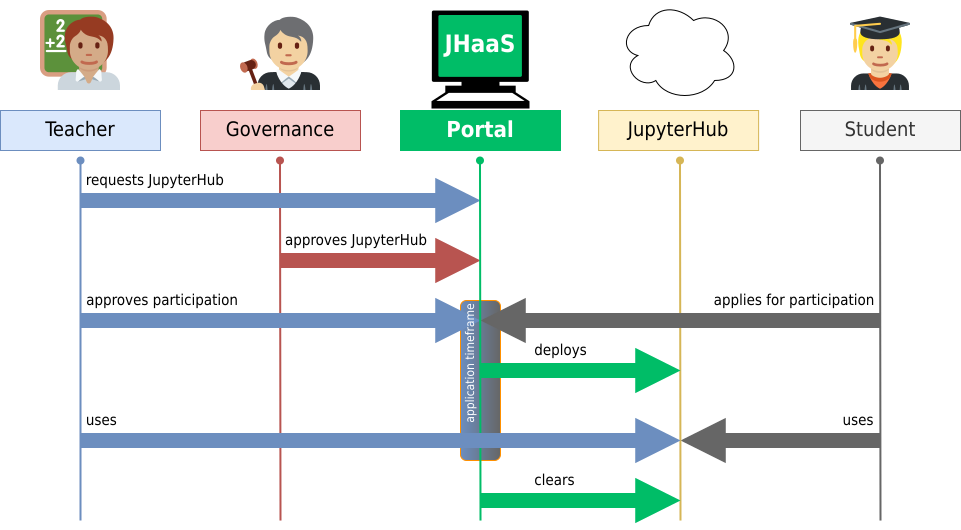
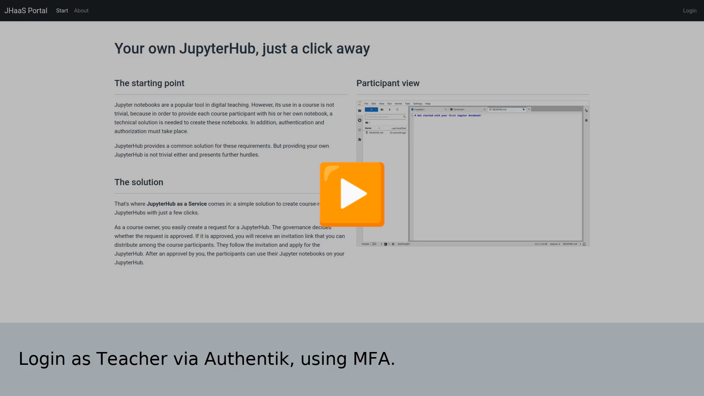
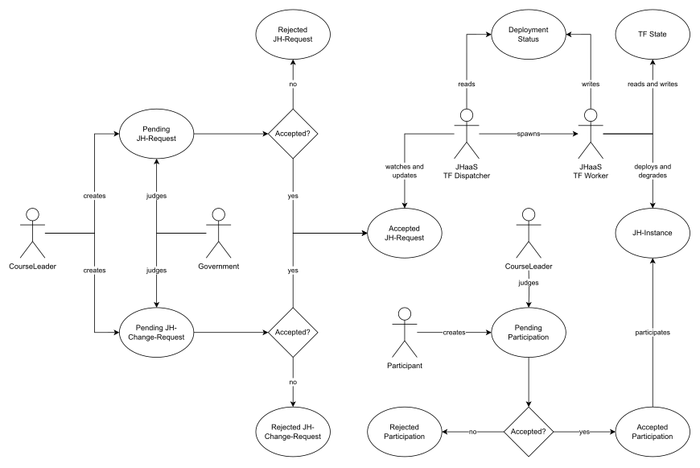

# JupyterHub as a Service - Getting Started

On-Demand Course-Related JupyterHubs for Research and Teaching.

## What is this and why do we have it?

JupyterHub as a Service (short: **JHaaS**) is a platform that can be used to offer courses and workshops based on Jupyter notebooks. JHaaS not only assumes the role of the pure organizer, but also allows registration of course participants, admission decisions for course leaders and the automatic deployment of user-defined JupyterHubs for each course.

On the one hand, this allows course leaders to use Jupyter notebooks that are perfectly tailored to their course, while at the same time relieving the burden on an institution's administrators, as the deployment and degration of the JupyterHubs is fully automated.

### The organizational process



The illustration shows the general life cycle of a JupyterHub for teaching via the JHaaS platform.

1. The course leader requests a course with their individual requirements.
2. The governance (e.g. the institution's administrators) decides whether the course leader's request is approved.
3. Once the request has been approved, the course leader can provide the course participants with an invitation link. Course participants can apply for the course. The course leader can approve or reject the individual applications.
4. At the beginning of the course, JHaaS automatically deploys the JupyterHub.
5. The JupyterHub can now be used to its full extent for the course. New participants can still apply for the course.
6. After the end of the course, JHaaS will degrade the JupyterHub.

### See it in action

[](https://jlubox.uni-giessen.de/getlink/fiAWtpfgvH8u68rhebiUX4AQ/JHaaS.webm)


### The technical process



After a course leader has created a request and governance has approved it, the request is in the `ACCEPTED` state. The JHaaS Dispatcher is a cron job that regularly checks whether requests in this state are ready for deployment, i.e. whether the course is about to start.

If this is the case, the CronJob dispatches another job, the so-called Terraform Worker. This Terraform Worker contains a standardized Terraform configuration for deploying a JupyterHub as well as an individual configuration for the specific course.

The Terraform Worker writes the result, including some important information, to the deployment status (an object on s3). Other important information like the terraform state will be uploaded to a dedicated s3 bucket. The deployment can be succeeded or failed at this point. The dispatcher cronjob reads this result and updates the course in JHaaS accordingly.

If the deployment was successful, the status of the course changes to `DEPLOYED`, otherwise to `FAILED`. In the latter case, course instructors and administrators are informed of the failure by email and manual intervention is required. If the deployment was successful, the JupyterHub can be used to its full extent.

The dispatcher cronjob regularly checks whether requests in the `DEPLOYED` state are ready to be degraded, i.e. when the course is over. If this is the case, it will deploy another Terraform Worker job to degrade the JupyterHub. The terraform worker job again writes its result back to the status. The degration can be succeeded or failed at this point. The dispatcher cronjob reads this result and updates the course in JHaaS accordingly. If the degration was successful, the status of the course changes to `DEGRADED`, otherwise to `FAILED`. In the latter case, course instructors and administrators are informed of the failure by email and manual intervention is required. If the degration was successful, the life cycle of the JupyterHub is completed.

### More Resources

We created a Poster as well as an extended abstract as part of the CoRDI2023:

- [The Poster](./CoRDI2023-JHaaS-Poster.pdf)
- [The Extended Abstract](./CoRDI2023-JHaaS-Poster-Extended-Abstract.pdf)

## Get up and Running JHaaS

JHaaS consists of many components that interact with each other. In order to make deployment as simple as possible, we have put together a Terraform configuration that makes deploying JHaaS easier.

In the following instructions, OpenTofu is used instead of Terraform. However, the installation can also be used with Terraform, just replace the command `tofu` with `terraform`.

### Requirements

You should be familiar with Kubernetes, Helm and OpenTofu / Terraform to run JHaaS.

To install a minimal JHaaS setup, you need at least:

- A kubernetes Cluster for the JHaaS Portal and the JupyterHubs (may or may not be the same)
- A FQDN and a wildcard entry on subdomains under your FQDN
- A Mail Server (as there is non included)
- On your local machine: OpenTofu or Terraform

In Order to run JHaaS in production, you should have at least following components as external and backed up services instead of using the bundled versions:

- A postgres database (might also work with mysql / mariadb, but has not been tested)
- A s3 compatible object storage

### Get the configuration

The Terraform configuration can be downloaded from our [public mirror of the deployment repository](https://github.com/JLU-BCF/JHaaS-Deployment). It contains submodules, so make sure to include them by either cloning with the `--recurse-submodules` option:

```
git clone --recurse-submodules https://github.com/JLU-BCF/JHaaS-Deployment.git
```

or add them in advance by initalising and updating the submodules manually:

```
git submodule init
git submodule update
```

### Set up your environment

After cloning the configuration, you have to setup the variables for your deployment. To do this, create the `terraform.tfvars` file and populate it according to your facts.

You can find all mandatory keys in the `variables.mandatory.tf` file, all optional keys in the `variables.optional.tf` file and all version keys in the `variables.versions.tf` file.

In order to use authentik and the portal in a proper way, you should set the email preferences even if they are technically not mandatory. Also you might want to customize the bootstrap email for authentik.

Furthermore it is a good idea to fix the version to be used. Have a look in the `variables.versions.tf` in order to get a list of all versions you can set. Otherwise simply the latest versions will be applied which isn't necessarily a good idea.

You can also control which parts of the configuration should be deployed and which should not. This is particularly helpful if you want to use an external database and external s3 storage, for example. Of course, components such as the Ingress Controller or the Cert Manager only need to be deployed if they are not already present in the cluster.

A sample configuration could lool like this:

```
# K8s config
kubeconfig = "/path/to/kubeconf"

# Domain config
authentik_fqdn        = "auth.local"
portal_fqdn           = "jhaas.local"
jupyterhubs_base_fqdn = "jhaas.local"
cm_issuer_email       = "demo@jhaas.local"

# Mail config
mail_host      = "mailhog.local"
mail_port      = "25"
mail_ssl       = false
mail_tls       = false
mail_from      = "jhaas@jhaas.local"
mail_from_name = "JHaaS Local"

# Set you bootstrap email address
authentik_bootstrap_mail = "admin@jhaas.local"

# Control which parts of JHaaS config are to be deployed.
deploy_nginx_ingress_controller = true
deploy_cert_manager             = true
deploy_postgres                 = true
deploy_redis                    = true
deploy_minio                    = true
deploy_authentik                = true
configure_authentik             = true
deploy_jhaas                    = true
```

#### Deploy without knowing the IP Address in advance

In many cases, the specific IP address of an load balancer only becomes known when the load balancer is created. This is usually the case when e.g. an ingress is created. In this case, a DNS entry only be registered once the ingress of the deployment has been created.

The deployment and configuration of Authentik as well as the deployment of the JHaaS portal can only be successful if a corresponding DNS entry exists, as this is the only way to create a valid SSL certificate. (Technically, a valid certificate can of course already exist beforehand, but this case is not yet covered in the deployment).

The solution to this problem is to first install only the dependencies (including the ingress) by setting the deployment configuration e.g. as follows:

```
# Control which parts of JHaaS config are to be deployed.
deploy_nginx_ingress_controller = true
deploy_cert_manager             = true
deploy_postgres                 = true
deploy_redis                    = true
deploy_minio                    = true
deploy_authentik                = false
configure_authentik             = false
deploy_jhaas                    = false
```

After the dependencies have been deployed, get the IP of the load balancer. You can see it as external endpoint in the loadbalancer service created for the new nginx ingress.

You may then set up your FQDNs to match this IP Address. Make sure the DNS has synced the records before continueing.

You might then also set `deploy_authentik`, `configure_authentik` and `deploy_jhaas` to true and reapply the configuration.

#### Deploy JHaaS Portal into another K8s cluster than the JupyterHubs

There might be good reasons to separate the JHaaS portal from the cluster where the JupyterHubs should be deployed. This makes it possible, for example, to operate the portal in a private cloud in an internal network while the JupyterHub cluster is located in a public cloud. This means that internal company services such as central databases or mail servers can be used, for example, which would not be accessible from outside network.

To implement this setup, clone the deployment repository twice: once for the portal and once for the JupyterHub cluster.

For the portal deployment, you need to deploy all parts of the setup and in addition you need to set the kubeconfig for the JupyterHub Cluster as follows:

```
# K8s config
kubeconfig            = "/path/to/kubeconf/for/portal"
jhaas_kubeconfig_hubs = "/path/to/kubeconf/for/jupyterhubs"

# [...]

# Control which parts of JHaaS config are to be deployed.
deploy_nginx_ingress_controller = true
deploy_cert_manager             = true
deploy_postgres                 = true
deploy_redis                    = true
deploy_minio                    = true
deploy_authentik                = true
configure_authentik             = true
deploy_jhaas                    = true
```

For the cluster on which the JupyterHubs are to be deployed, you only need an ingress controller and the certmanager:

```
# K8s config
kubeconfig      = "/path/to/kubeconf/for/jupyterhubs"

# [...]

deploy_nginx_ingress_controller = true
deploy_cert_manager             = true
deploy_postgres                 = false
deploy_redis                    = false
deploy_minio                    = false
deploy_authentik                = false
configure_authentik             = false
deploy_jhaas                    = false
```

Once again, the components only need to be installed if they do not already exist.

### Deploy JHaaS

After setting the variables for the configuration properly, initialize the Terraform configuration:

```
tofu init
```

and then apply the configuration with:

```
tofu apply
```

> ❕ Notice
> 
> Depending on your local setup you might run to an issue that helm repos aren't cached locally. Just run `helm repo update` manually and try again.


## JHaaS / Authentik: First steps

After deployment, it is time to log in for the first time. To get the password for the bootstrap user, run:

```
tofu output authentik_password
```

Use this password in combination with the bootstrap email address that you entered in the configuration (default: `akadmin@jhaas.intern` if bootstrap email left blank). You will be guided through the creation of the two-factor authentication and recovery codes will be created for the account. The bootstrap account is the (first) admin account for Authentik.

In order to obtain suitable permissions in the JHaaS portal, your account must be a member of groups `portal_leaders`, `portal_admins` and `admins`. Go to `authentik settings -> admin interface -> directory -> users` and open the `akadmin` user. Add the named groups to your account. You might also want to set a proper Family and Given Name for your account.

Head back to the JHaaS Portal, navigate to your account settings and click on `sync roles`. The JHaaS system is now fully operational.

## In-Depth: Components of JHaaS

### Portal Backend

👉 [Repository](https://github.com/JLU-BCF/JHaaS-Portal-Backend)

Provides API for the JHaaS Portal.

### Portal Frontend

👉 [Repository](https://github.com/JLU-BCF/JHaaS-Portal-Frontend)

Provides UI for the JHaaS Portal.

### TF Worker

👉 [Repository](https://github.com/JLU-BCF/JHaaS-TF-Worker)

Deploys a JupyterHub via OpenTofu in JHaaS context.

## In-Depth: Configuration of JHaaS

### TF Config

👉 [Repository](https://github.com/JLU-BCF/JHaaS-TF-Config)

Terraform configuration for JupyterHub deployments in context of JHaaS.

### Authentik Config

👉 [Repository](https://github.com/JLU-BCF/JHaaS-Authentik-Config)

Terraform configuration to seed Authentik in context of JHaaS.

### Portal Helm Chart

👉 [Repository](https://github.com/JLU-BCF/JHaaS-Portal-Helm-Chart)

Helm Chart to deploy the JHaaS Portal.

### Deployment Config

👉 [Repository](https://github.com/JLU-BCF/JHaaS-Deployment)

Terraform configuration that generates and combines all neccessary variables, modules and charts in order to deploy JHaaS.
